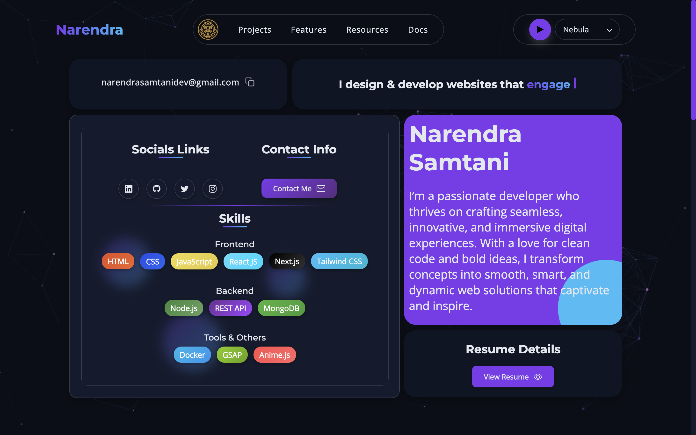

# 🚀 Modern Portfolio Website

> A sleek, responsive portfolio website showcasing modern web development skills with pure HTML, CSS, and vanilla JavaScript

[](https://alenway.github.io/modernportfolio)
[](https://github.com/alenway/modernportfolio)
[](LICENSE)
[]()
[]()
[]()



## 🎯 About This Project

This modern portfolio website is crafted with **pure vanilla technologies** - no frameworks, no dependencies, just clean and efficient code. Built to showcase professional skills while demonstrating mastery of fundamental web technologies.

## ✨ Features

### 🎨 **Modern Design**

-   **Responsive Layout** - Seamlessly adapts to all screen sizes
-   **Dark/Light Theme** - Toggle between themes with smooth transitions
-   **Smooth Animations** - Engaging micro-interactions and scroll animations
-   **Glassmorphism Effects** - Modern UI with frosted glass aesthetics
-   **Mobile-First Approach** - Optimized for mobile devices

### 🛠️ **Built With Pure Technologies**

-   **Pure HTML5** - Semantic markup and accessibility-first approach
-   **Pure CSS3** - Advanced styling with Grid, Flexbox, and Custom Properties
-   **Vanilla JavaScript** - ES6+ features without external dependencies
-   **No Build Tools** - Direct browser-ready code
-   **No Frameworks** - Lightweight and fast-loading

### 📱 **Sections Included**

-   **Hero Section** - Eye-catching introduction with call-to-action
-   **About Me** - Personal story and professional background
-   **Skills** - Technical expertise with interactive skill bars
-   **Projects** - Showcase of best work with live demos
-   **Experience** - Professional journey and achievements
-   **Contact** - Multiple ways to get in touch
-   **Footer** - Additional links and information

## 🚀 Quick Start

### Prerequisites

-   Modern web browser (Chrome, Firefox, Safari, Edge)
-   Text editor (VS Code, Sublime Text, etc.)
-   Basic knowledge of HTML, CSS, and JavaScript

### Installation

1. **Clone the repository**

    ```bash
    git clone git@github.com:alenway/modernportfolio.git
    cd modernportfolio
    ```

2. **Open in your browser**

    ```bash
    # Using Python (if installed)
    python -m http.server 8000

    # Using Node.js (if installed)
    npx serve .

    # Or simply open index.html in your browser
    ```

3. **Start customizing!**
    - Edit `index.html` for content
    - Modify `styles.css` for styling
    - Update `script.js` for functionality

## 🎯 Customization Guide

### 🖼️ **Adding Your Content**

1. **Personal Information**

    ```html
    <!-- Update in index.html -->
    <h1>Your Name</h1>
    <p>Your professional title</p>
    ```

2. **Projects Section**

    ```html
    <!-- Add your projects -->
    <div class="project-card">
        
        <h3>Project Title</h3>
        <p>Project description...</p>
    </div>
    ```

3. **Contact Information**
    ```html
    <!-- Update contact details -->
    <a href="mailto:your.email@domain.com">your.email@domain.com</a>
    <a href="tel:+1234567890">+1 (234) 567-890</a>
    ```

### 🎨 **Theming**

The website uses CSS custom properties for easy theming:

```css
:root {
    --primary-color: #4f46e5; /* Main brand color */
    --secondary-color: #06b6d4; /* Accent color */
    --text-primary: #1f2937; /* Main text */
    --bg-primary: #ffffff; /* Background */
}
```

### 📱 **Responsive Breakpoints**

-   **Mobile**: < 768px
-   **Tablet**: 768px - 1024px
-   **Desktop**: > 1024px

## 🛠️ Technologies & Approach

### **Core Technologies**

| Technology                                                                                               | Purpose               | Approach                                     |
| -------------------------------------------------------------------------------------------------------- | --------------------- | -------------------------------------------- |
|                 | Structure & Semantics | Semantic HTML5 elements, accessibility-first |
|                    | Styling & Layout      | CSS Grid, Flexbox, Custom Properties         |
|  | Interactivity         | Vanilla ES6+, DOM manipulation               |

### **Why Vanilla Technologies?**

-   **Performance**: Zero framework overhead, lightning-fast loading
-   **Learning**: Deep understanding of web fundamentals
-   **Compatibility**: Works across all modern browsers
-   **Maintainability**: No dependency management or breaking changes
-   **Simplicity**: Clean, readable code that's easy to understand

## 📊 Performance

-   **PageSpeed Insights**: 95+ score
-   **First Contentful Paint**: < 1.5s
-   **Largest Contentful Paint**: < 2.5s
-   **Cumulative Layout Shift**: < 0.1

## 🌐 Browser Support

| Browser | Version |
| ------- | ------- |
| Chrome  | ✅ 88+  |
| Firefox | ✅ 85+  |
| Safari  | ✅ 14+  |
| Edge    | ✅ 88+  |

## 📁 Project Structure

```
modernportfolio/
├── 📄 index.html          # Main HTML file
├── 📄 style.css           # Main stylesheet
├── 📄 script.js           # JavaScript functionality
├── 📁 assets/             # Images and media
│   ├── 📁 images/         # Project screenshots & photos
│   ├── 📁 icons/          # Custom icons and favicons
│   └── 📄 resume.pdf      # Downloadable resume
├── 📁 sections/           # Individual section files (if modular)
│   ├── 📄 hero.html       # Hero section
│   ├── 📄 about.html      # About section
│   ├── 📄 projects.html   # Projects showcase
│   └── 📄 contact.html    # Contact section
├── 📄 README.md           # This file
├── 📄 LICENSE             # MIT License
└── 📄 .gitignore          # Git ignore rules
```

## 🚀 Deployment

### **Vercel** (Recommended)

```bash
npm install -g vercel
vercel --prod
```

### **Netlify**

1. Drag and drop your project folder to [Netlify Deploy](https://app.netlify.com/drop)
2. Your site is live! 🎉

### **GitHub Pages**

1. Push your code to GitHub
2. Go to Settings → Pages
3. Select source branch (main)
4. Your site will be available at `https://alenway.github.io/modernportfolio`

### **Custom Domain Setup**

If you have a custom domain, add a `CNAME` file to your repository:

```
echo "yourdomain.com" > CNAME
```

## 🤝 Contributing

Contributions are welcome! Here's how you can help:

1. **Fork the repository**
2. **Create a feature branch**
    ```bash
    git checkout -b feature/amazing-feature
    ```
3. **Commit your changes**
    ```bash
    git commit -m 'Add some amazing feature'
    ```
4. **Push to the branch**
    ```bash
    git push origin feature/amazing-feature
    ```
5. **Open a Pull Request**

## 🎨 Key Features Breakdown

### **Hero Section**

-   Animated typing effect with multiple roles/titles
-   Smooth scroll-triggered animations
-   Call-to-action buttons with hover effects
-   Social media integration

### **Projects Section**

-   Interactive project cards with hover states
-   Live demo and GitHub links
-   Technology stack badges
-   Responsive grid layout
-   Image lazy loading for performance

### **Skills Section**

-   Animated progress bars
-   Technology categorization (Frontend, Backend, Tools)
-   Skill level indicators
-   Interactive hover effects

### **Contact Section**

-   Working contact form (if backend integrated)
-   Social media links
-   Downloadable resume
-   Location and availability status

## 💡 Code Highlights

### **CSS Custom Properties for Theming**

```css
:root {
    --primary-color: #667eea;
    --secondary-color: #764ba2;
    --accent-color: #f093fb;
    --text-primary: #2d3748;
    --text-secondary: #4a5568;
    --bg-primary: #ffffff;
    --bg-secondary: #f7fafc;
}

[data-theme="dark"] {
    --text-primary: #f7fafc;
    --text-secondary: #e2e8f0;
    --bg-primary: #1a202c;
    --bg-secondary: #2d3748;
}
```

### **Smooth Scroll Implementation**

```javascript
// Smooth scrolling for navigation links
document.querySelectorAll('a[href^="#"]').forEach((anchor) => {
    anchor.addEventListener("click", function (e) {
        e.preventDefault();
        const target = document.querySelector(this.getAttribute("href"));
        target.scrollIntoView({
            behavior: "smooth",
            block: "start",
        });
    });
});
```

### **Intersection Observer for Animations**

```javascript
// Animate elements on scroll
const observerOptions = {
    threshold: 0.1,
    rootMargin: "0px 0px -100px 0px",
};

const observer = new IntersectionObserver((entries) => {
    entries.forEach((entry) => {
        if (entry.isIntersecting) {
            entry.target.classList.add("animate-in");
        }
    });
}, observerOptions);
```

## 📝 Development Journey

### Version 2.0.0 (Latest)

-   ✨ Added comprehensive dark/light theme system
-   🎨 Redesigned with modern glassmorphism effects
-   📱 Enhanced mobile-first responsive design
-   ⚡ Optimized performance with lazy loading
-   🔧 Added advanced CSS animations and transitions
-   📊 Implemented scroll-triggered animations

### Version 1.5.0

-   🎯 Added smooth scrolling navigation
-   💫 Implemented intersection observer animations
-   🖼️ Created interactive project gallery
-   📊 Added animated skill progress indicators
-   🌟 Enhanced hero section with typing animation

### Version 1.0.0

-   🎉 Initial release with core sections
-   🏠 Hero section with professional introduction
-   💼 Projects showcase with live demos
-   📞 Contact section with social integration
-   🎨 Custom CSS animations and effects

## 📋 Roadmap & Future Enhancements

-   [ ] **Backend Integration** - Contact form with email functionality
-   [ ] **Blog Section** - Technical articles and tutorials
-   [ ] **CMS Integration** - Easy content management
-   [ ] **Advanced Animations** - Scroll-triggered animations with GSAP
-   [ ] **PWA Features** - Offline support and app-like experience
-   [ ] **Multi-language Support** - International accessibility
-   [ ] **Analytics Integration** - Visitor tracking and insights
-   [ ] **Performance Optimization** - Image optimization and caching
-   [ ] **Accessibility Enhancements** - Screen reader improvements
-   [ ] **Testing Suite** - Automated testing for reliability

## 📄 License

This project is licensed under the MIT License - see the [LICENSE](LICENSE) file for details.

## 🙏 Acknowledgments

-   **Design Inspiration**: [Dribbble](https://dribbble.com), [Awwwards](https://awwwards.com)
-   **Icons**: [Lucide Icons](https://lucide.dev), [Heroicons](https://heroicons.com)
-   **Fonts**: [Google Fonts](https://fonts.google.com)
-   **Colors**: [Tailwind CSS](https://tailwindcss.com/docs/customizing-colors)

## 📞 Contact & Support

**Got questions, suggestions, or want to collaborate?**

[](mailto:contact@alenway.dev)
[](https://linkedin.com/in/alenway)
[](https://github.com/alenway)
[](https://alenway.github.io/modernportfolio)

---

<div align="center">

**⭐ Star this repository if it inspired your portfolio journey! ⭐**

_Built with passion for clean code and modern web development_

**Made with ❤️ and ☕ by [Alenway](https://github.com/alenway)**

_Crafted in 2024 • Updated regularly_

</div>
